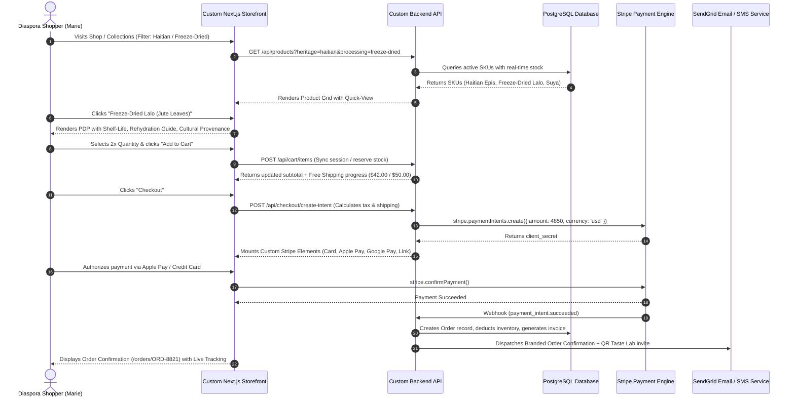
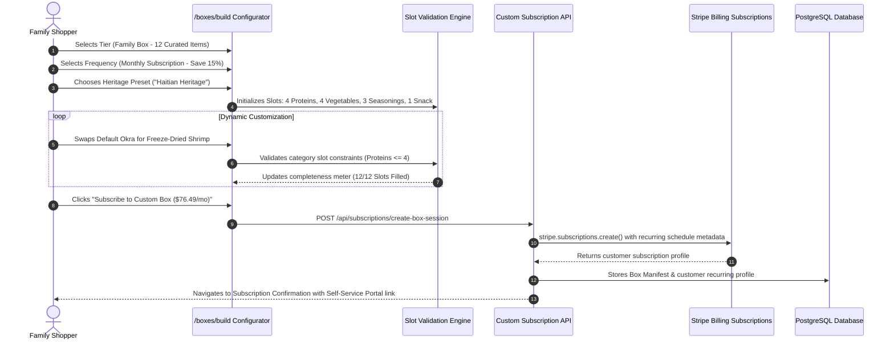
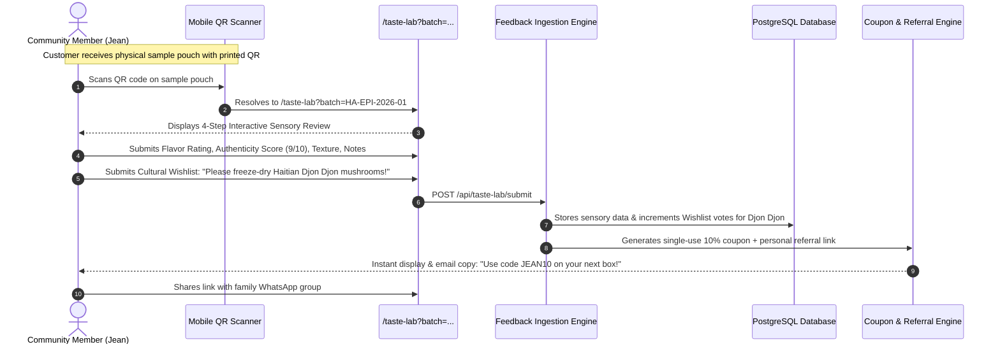
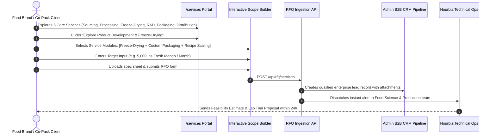
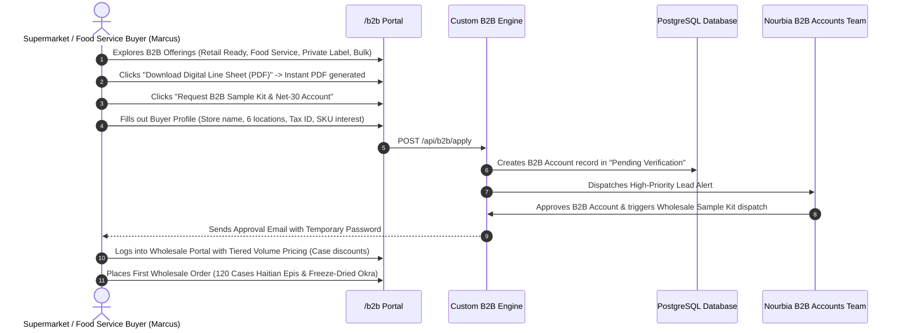
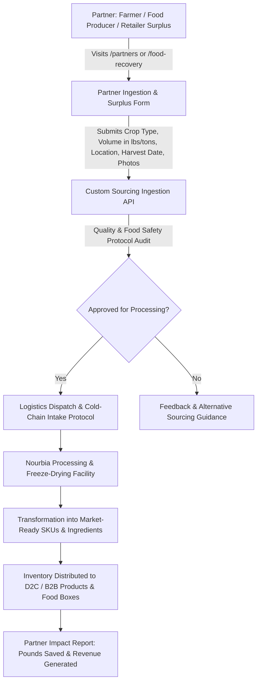
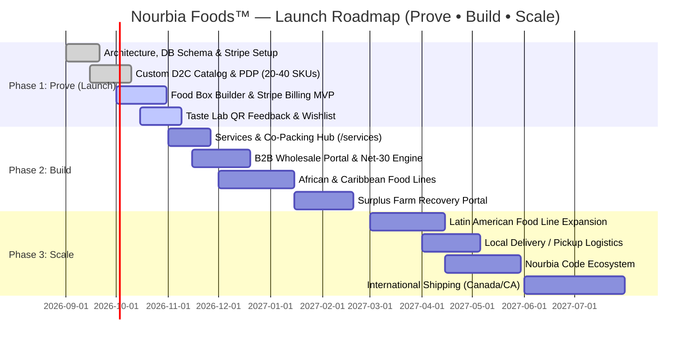

# NOURBIA FOODS™ — End-to-End Custom E-Commerce & Platform Architecture
**Advancing Culturally Relevant Nutrition • Meeting People Where They Are**
*Food products • Food processing • Food solutions*

---

## 1. Executive Overview & System Architecture

### 1.1 Brand & Product Vision
**Nourbia Foods™** is a modern, for-profit food processing and distribution company with a strong social purpose: **advancing culturally relevant nutrition and food sovereignty** by meeting people where they are.

Nourbia bridges the gap across the complete food lifecycle:
$$\text{Food Sourcing} \longrightarrow \text{Food Processing} \longrightarrow \text{Freeze-Drying} \longrightarrow \text{Product Development} \longrightarrow \text{Packaging} \longrightarrow \text{Distribution}$$

```
┌───────────────────────────────────────────────────────────────────────────────────────────┐
│                                 NOURBIA CORE SERVICES ENGINE                              │
│  Source ──► Process ──► Preserve (Freeze-Dry) ──► Product Dev ──► Package ──► Distribute   │
└─────────────────────────────────────────────┬─────────────────────────────────────────────┘
                                              │
        ┌──────────────────────────────┬──────┴──────────────────────┬──────────────────────┐
        ▼                              ▼                             ▼                      ▼
┌───────────────┐              ┌───────────────┐             ┌───────────────┐      ┌───────────────┐
│  Custom D2C   │              │ Nourbia Boxes │             │   Community   │      │  B2B/Services │
│ (Catalog/Shop)│              │ (Box Builder) │             │  (Taste Lab)  │      │ (Wholesale)   │
└───────┬───────┘              └───────┬───────┘             └───────┬───────┘      └───────┬───────┘
        │                              │                             │                      │
        └──────────────────────────────┴──────────────┬──────────────┴──────────────────────┘
                                                      ▼
┌───────────────────────────────────────────────────────────────────────────────────────────┐
│              CUSTOM FULL-STACK ENGINE & SECURE INFRASTRUCTURE (NO SHOPIFY)                │
│   Next.js 14+ Frontend • Python FastAPI Async Backend • PostgreSQL (SQLAlchemy) • Redis   │
│   Stripe Elements (Cards/Apple Pay/Google Pay) • Stripe Billing Subscriptions             │
│   SendGrid / Resend Transactional Emails • EasyPost / Carrier Shipping Calculation       │
└───────────────────────────────────────────────────────────────────────────────────────────┘
```

### 1.2 Core Strategic Principles (Prove • Build • Scale)
1. **Prove**: Initial launch with 20–40 high-priority SKUs focused on the Haitian food foundation as proof-of-concept, establishing demand validation, food-safety review, and community testing.
2. **Build**: Expand processing and freeze-drying infrastructure, B2B wholesale distribution, surplus food recovery, and custom co-packing / private-label services.
3. **Scale**: Expand into African, Latin American, Caribbean, and global diaspora markets across all 50 US states, Canada, and international territories.
4. **Cultural Food Sovereignty**: Don't dictate what people need; provide the platform for communities to express food desires, test samples, share authentic feedback, and shape future SKUs.

---

## 2. User Personas & System Roles

```
┌──────────────────────────────────────────────────────────────────────────────────┐
│                               USER ACTOR MATRIX                                  │
├──────────────────────┬────────────────────────────────────┬──────────────────────┤
│ Actor                │ Core Motivations                   │ Primary Touchpoints  │
├──────────────────────┼────────────────────────────────────┼──────────────────────┤
│ 1. Diaspora Consumer │ Access authentic cultural foods,   │ Custom D2C Catalog,  │
│    (e.g., Marie)     │ long shelf life, convenient prep   │ Food Box Builder     │
├──────────────────────┼────────────────────────────────────┼──────────────────────┤
│ 2. Community Co-     │ Taste-test samples, shape new SKUs,│ Community Taste Lab, │
│    Creator / Tester  │ vote on regional foods, earn perks │ QR Feedback Portal   │
├──────────────────────┼────────────────────────────────────┼──────────────────────┤
│ 3. B2B / Wholesale   │ Sourcing shelf-stable ingredients, │ B2B Wholesale Hub,   │
│    Buyer (Retail/FS) │ private label, retail packaging    │ Sample RFQ Generator │
├──────────────────────┼────────────────────────────────────┼──────────────────────┤
│ 4. Food Service &    │ Commercial kitchen ingredients,    │ Food Service Portal, │
│    Institution Buyer │ pre-portioned prepared meals       │ Bulk Ordering Desk   │
├──────────────────────┼────────────────────────────────────┼──────────────────────┤
│ 5. Food Recovery &   │ Monetize surplus produce, partner  │ Partner Ingestion    │
│    Farm Partner      │ on freeze-drying / processing      │ Portal               │
├──────────────────────┼────────────────────────────────────┼──────────────────────┤
│ 6. Food Brand / Co-  │ Private label, custom product dev, │ Services Hub,        │
│    Pack Client       │ contract freeze-drying & packaging │ Custom RFQ Builder   │
├──────────────────────┼────────────────────────────────────┼──────────────────────┤
│ 7. Store Operations  │ SKU catalog, box assembly rules,   │ Custom Admin Console │
│    & Fulfillment     │ B2B leads, batch traceability      │ & Order Pipeline     │
└──────────────────────┴────────────────────────────────────┴──────────────────────┘
```

---

## 3. Global Information Architecture & Sitemap

```mermaid
graph TD
    Home[Homepage /] --> Shop[Shop Products /shop]
    Home --> Services[Our Services /services]
    Home --> Boxes[Nourbia Food Boxes /boxes]
    Home --> FreezeDry[Freeze-Drying Tech /freeze-drying]
    Home --> Community[Taste Lab & Community /community]
    Home --> B2B[For Business / B2B /b2b]
    Home --> Partners[Partner With Us /partners]
    Home --> Recovery[Food Recovery /food-recovery]
    Home --> About[About Nourbia /about]
    Home --> Contact[Contact Us /contact]

    Shop --> Haitian[Haitian Heritage Line]
    Shop --> African[African Heritage Line]
    Shop --> Latin[Latin American Line]
    Shop --> Caribbean[Caribbean Heritage Line]
    Shop --> CatFruits[Fruits]
    Shop --> CatVeg[Vegetables & Herbs]
    Shop --> CatProt[Proteins]
    Shop --> CatStaples[Staples - Rice/Beans/Grains]
    Shop --> CatSpices[Seasonings & Flavors]
    Shop --> CatPrepared[Prepared Foods & Sauces]
    Shop --> CatSnacks[Snacks]
    Shop --> PDP[Product Detail Page /products/:slug]

    Services --> ServSourcing[Food Sourcing]
    Services --> ServProcessing[Food Processing]
    Services --> ServFreezeDry[Freeze-Drying Preservation]
    Services --> ServProdDev[Product Development]
    Services --> ServPackaging[Packaging & Private Label]
    Services --> ServDist[Distribution & Logistics]

    Boxes --> BoxConfig[Interactive Box Builder /boxes/build]
    Boxes --> BoxTiers[Individual / Family / Multi-Family / Custom]

    Community --> TasteTest[Dynamic QR Feedback /taste-lab?batch=...]
    Community --> RequestFood[Request a Cultural Food /request-food]
    Community --> ReferShare[Share & Earn Rewards /share]

    B2B --> B2BRetail[Retail Ready Products]
    B2B --> B2BWholesale[Wholesale Distribution & Net-30]
    B2B --> B2BFoodService[Food Service & Bulk]
    B2B --> B2BPrivateLabel[Private Label & Custom]

    Partners --> PartFarmers[Farmers & Producers]
    Partners --> PartRetailers[Retailers & Grocers]
    Partners --> PartDistributors[Distributors & Institutions]

    PDP --> Cart[Slide-Out Cart Drawer /cart]
    BoxConfig --> Cart
    Cart --> Checkout[Custom Stripe Embedded Checkout /checkout]
    Checkout --> OrderSuccess[Order Confirmation & Tracking /orders/:id]
    
    Account[Customer Portal /account] --> AccOrders[Order History & PDF Invoices]
    Account --> AccSubs[Stripe Box Subscriptions Management]
    Account --> AccTaste[Taste Lab Badges & Wishlist Votes]
    
    Admin[Admin Console /admin] --> AdmCatalog[Catalog & Inventory Manager]
    Admin --> AdmOrders[Orders & Carrier Label Dispatch]
    Admin --> AdmBoxes[Box Allocation Rules]
    Admin --> AdmTaste[Taste Lab & Demand Analytics]
    Admin --> AdmB2B[B2B & Surplus Partner Pipelines]
```



---

## 4. End-to-End Application Flows with Step-by-Step Logic

### 4.1 Flow 1: Custom D2C E-Commerce Product Discovery & Stripe Checkout Flow



---

### 4.2 Flow 2: Nourbia Food Boxes (Interactive Customizer & Stripe Subscription Flow)



#### Box Tier Matrix:
| Box Tier | Target Household | Standard Contents | Customization Options | Delivery Options |
| :--- | :--- | :--- | :--- | :--- |
| **Individual Box** | 1 Person (Everyday needs) | 6 Items (2 Proteins, 2 Veg/Fruits, 2 Seasonings) | 100% custom swap or Chef Curated | One-Time / Bi-Weekly / Monthly (15% Off) |
| **Family Box** | 3–5 Persons | 12 Items (4 Proteins, 4 Veg, 3 Seasonings, 1 Snack) | Cultural Theme presets + item swaps | Monthly / Bi-Monthly (15% Off) |
| **Multi-Family Box** | Extended families / Shared | 24 Items (Bulk Staples, Proteins, Large Seasonings) | Bulk allocation per culture | Monthly / Custom Schedule (15% Off) |
| **Custom / Organization** | Community Hubs / Relief / Special | Fully dynamic line items | Tailored dietary & cultural specs | On-demand / Invoice Net terms |

---

### 4.3 Flow 3: Community Voice & Cultural Food Sovereignty Flow
*(Taste → Test → Share → Recommend → Shape the Next Product)*



---

### 4.4 Flow 4: Core Services & Custom Processing Inquiry Flow (`/services`)



---

### 4.5 Flow 5: B2B Wholesale, Retailer & Food Service Acquisition Flow (`/b2b`)



---

### 4.6 Flow 6: Food Surplus Recovery & Partner Sourcing Flow (`/partners` & `/food-recovery`)



---

## 5. Complete Product Architecture & 7 Product Categories

The platform supports the complete range of product categories defined in the website project documentation:

```
┌──────────────────────────────────────────────────────────────────────────────────┐
│                           7 CORE PRODUCT CATEGORIES                              │
├──────────────────────┬───────────────────────────────────────────────────────────┤
│ Category             │ Products / SKUs Included                                  │
├──────────────────────┼───────────────────────────────────────────────────────────┤
│ 1. Fruits            │ Freeze-dried Mango, Strawberry, Banana, Pineapple,        │
│                      │ Passionfruit, Soursop, and culturally relevant fruits     │
├──────────────────────┼───────────────────────────────────────────────────────────┤
│ 2. Vegetables & Herbs│ Okra / Kalalou, Lalo (Jute Leaves), Epis herbs, Spinach,   │
│                      │ Bitter Leaf, Callaloo, and regional cooking greens        │
├──────────────────────┼───────────────────────────────────────────────────────────┤
│ 3. Proteins          │ Freeze-dried Fish (Snapper/Cod), Shrimp, Beef, Pork,      │
│                      │ Goat, and shelf-stable prepared protein cuts              │
├──────────────────────┼───────────────────────────────────────────────────────────┤
│ 4. Staples           │ Rice varieties, Dried & Pre-cooked Beans, Grains, Corn,    │
│                      │ Flours, Cassava, and Plantain meal                        │
├──────────────────────┼───────────────────────────────────────────────────────────┤
│ 5. Seasonings &      │ Haitian Epis, Pikliz blend, Suya spice, Jollof seasoning, │
│    Flavors           │ Shito, Berbere, Latin American Sazón, Épice blends        │
├──────────────────────┼───────────────────────────────────────────────────────────┤
│ 6. Prepared Foods    │ Shelf-stable meals, traditional sauces, soups, and ready- │
│                      │ to-use cooking bases & simmer pastes                      │
├──────────────────────┼───────────────────────────────────────────────────────────┤
│ 7. Snacks            │ Freeze-dried fruit crisps, seasoned crunchy vegetables,   │
│                      │ spiced seeds, plantain chips, and savory bites            │
└──────────────────────┴───────────────────────────────────────────────────────────┘
```

---

## 6. Complete Data Models & Schemas

### 6.1 Product Schema (`product.json`)
```json
{
  "id": "prod_haitian_epis_01",
  "sku": "NB-HT-EPI-01",
  "title": "Haitian Epis Traditional Seasoning",
  "brand": "Nourbia Foods",
  "category": "Seasonings & Flavors",
  "cultural_heritage": "Haitian",
  "processing_type": "Freeze-Dried Formulation",
  "pricing": {
    "retail_price_usd": 9.99,
    "subscription_price_usd": 8.49,
    "wholesale_case_price_usd": 72.00,
    "case_pack_qty": 12
  },
  "specifications": {
    "net_weight_oz": 3.2,
    "reconstituted_yield_oz": 16.0,
    "shelf_life_months": 300,
    "ingredients": ["Scallions", "Garlic", "Scotch Bonnet Peppers", "Thyme", "Bell Peppers", "Parsley", "Cloves", "Sea Salt"],
    "preservatives_added": false,
    "allergens": []
  },
  "culinary_notes": {
    "flavor_profile": "Herbaceous, aromatic, medium-hot citrus finish",
    "traditional_uses": ["Marinade for Griot (pork)", "Base for Rice and Beans (Diri ak Pwa)", "Fish & Poultry rubs"],
    "preparation_instructions": "Mix 1 tbsp Epis powder with 2 tbsp warm water and 1 tsp olive oil to rehydrate into fresh paste."
  },
  "inventory": {
    "warehouse_stock": 2400,
    "in_production_pipeline": 5000,
    "is_available_d2c": true,
    "is_available_b2b": true
  }
}
```

### 6.2 Custom Food Box Manifest (`food_box_order.json`)
```json
{
  "box_order_id": "BOX-99201",
  "box_type": "Family Box",
  "customer_id": "cust_440192",
  "stripe_subscription_id": "sub_1N8xQ2LkdIwHu7ix9",
  "cadence": "monthly_subscription",
  "allocated_items_count": 12,
  "manifest": [
    { "sku": "NB-HT-EPI-01", "name": "Haitian Epis", "qty": 2, "slot": "Seasoning" },
    { "sku": "NB-AF-SUY-01", "name": "Suya Seasoning Blend", "qty": 1, "slot": "Seasoning" },
    { "sku": "NB-FD-LAL-01", "name": "Freeze-Dried Lalo Leaves", "qty": 2, "slot": "Vegetable" },
    { "sku": "NB-FD-OKR-01", "name": "Freeze-Dried Okra (Kalalou)", "qty": 2, "slot": "Vegetable" },
    { "sku": "NB-FD-SHR-01", "name": "Freeze-Dried Wild Shrimp", "qty": 2, "slot": "Protein" },
    { "sku": "NB-FD-FIS-01", "name": "Freeze-Dried Snapper Fillets", "qty": 2, "slot": "Protein" },
    { "sku": "NB-FD-MNG-01", "name": "Freeze-Dried Mango Slices", "qty": 1, "slot": "Snack" }
  ],
  "pricing_summary": {
    "base_box_price": 89.99,
    "subscription_discount_15pct": -13.50,
    "shipping_fee": 0.00,
    "tax_amount": 0.00,
    "total_billed": 76.49
  }
}
```

---

## 7. Launch Roadmap (Prove • Build • Scale)



---

**NOURBIA FOODS™**  
*Advancing Culturally Relevant Nutrition • Meeting People Where They Are*  
© Nourbia Foods. All Rights Reserved.
